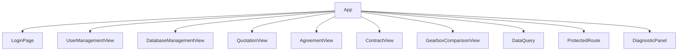
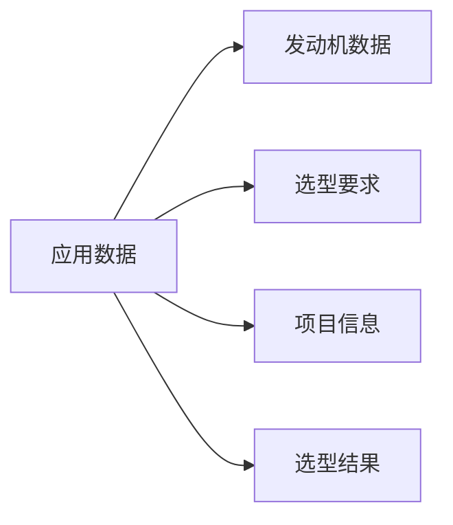
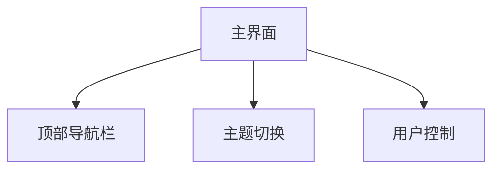

# 船用齿轮箱选型系统框架文档

## 1. 核心组件结构



## 2. 主要功能模块

### 2.1 用户认证模块
- 登录/登出功能
- 权限管理系统
- 用户角色控制

### 2.2 选型计算模块
- 发动机参数输入
- 选型要求设置
- 齿轮箱自动选型
- 选型结果展示

### 2.3 文档生成模块
- 报价单生成
- 技术协议生成
- 销售合同生成

### 2.4 数据管理模块
- 数据库验证
- 数据修正
- 价格历史追踪
- 批量价格调整

### 2.5 系统诊断模块
- 数据完整性检查
- 价格验证
- 系统状态监控

## 3. 数据流结构

### 3.1 状态管理


### 3.2 数据持久化
- localStorage 存储机制
- 数据同步机制
- 数据备份恢复

### 3.3 数据验证
- 输入验证
- 价格验证
- 数据完整性检查

## 4. 工具函数模块

### 4.1 价格计算工具
```javascript
// 示例代码结构
const priceCalculator = {
    calculateDiscount: () => {},
    calculateFactoryPrice: () => {},
    calculatePackagePrice: () => {},
    calculateMarketPrice: () => {}
};
```

### 4.2 数据适配器
- 数据格式转换
- 数据验证
- 数据标准化

### 4.3 文档生成器
- 报价单生成器
- 技术协议生成器
- 销售合同生成器

### 4.4 选型算法
- 齿轮箱选型
- 联轴器选型
- 备用泵选型

## 5. UI 组件结构

### 5.1 主界面布局


### 5.2 输入表单
- 发动机参数表单
- 选型要求表单
- 项目信息表单

### 5.3 结果展示
- 选型概要
- 齿轮箱详情
- 配件信息

### 5.4 文档视图
- 报价单视图
- 技术协议视图
- 销售合同视图

## 6. 系统特点

### 6.1 技术特点
- 基于 React 的现代化前端架构
- 响应式设计，支持多设备访问
- 模块化设计，便于维护和扩展
- 完整的状态管理机制

### 6.2 功能特点
- 支持深色/浅色主题切换
- 完整的用户认证和权限管理
- 丰富的文档生成和导出功能
- 实时数据验证和错误提示

### 6.3 数据特点
- 本地存储和实时验证
- 数据完整性保护
- 价格历史追踪
- 批量操作支持

## 7. 开发规范

### 7.1 代码规范
- 使用 ESLint 进行代码检查
- 遵循 React 最佳实践
- 统一的命名规范
- 完整的注释文档

### 7.2 组件规范
- 组件职责单一
- 合理的状态管理
- 统一的样式管理
- 完整的错误处理

### 7.3 文档规范
- 代码注释规范
- API 文档规范
- 更新日志规范
- 用户手册规范 